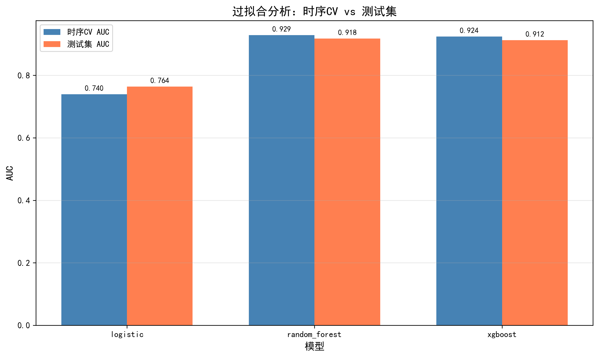
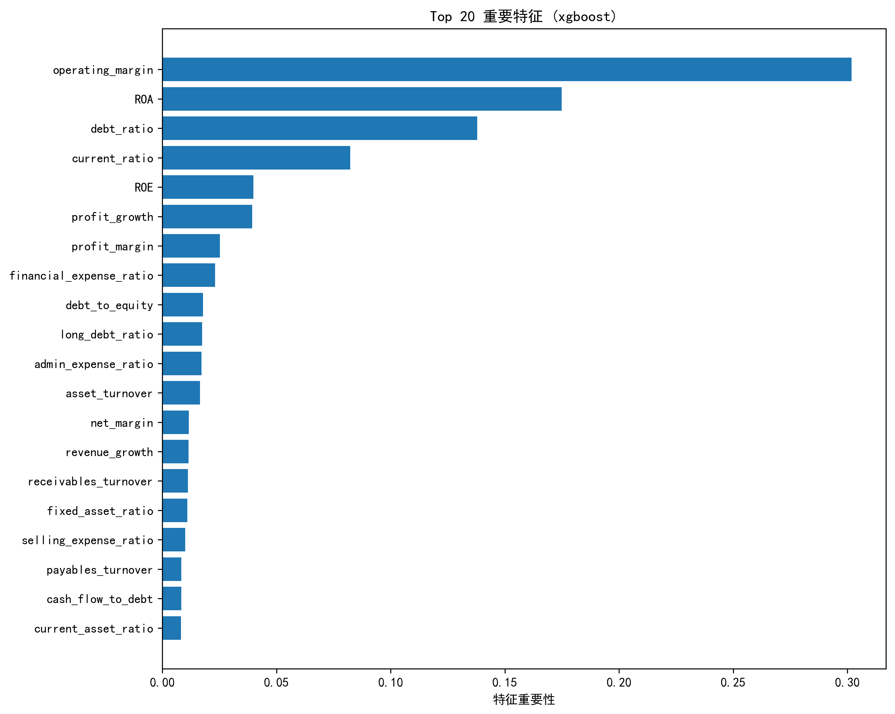

# 中国上市公司财务危机预测系统

基于机器学习的中国上市公司财务危机（ST/*ST）预测模型，使用CSMAR数据库进行训练和验证。

## 📋 项目简介

本项目构建了一个完整的上市公司财务危机预测系统，通过分析财务报表数据，预测公司是否会被特别处理（ST/*ST）。

### 核心特点

- 🎯 **高精度预测**：随机森林模型AUC达到0.92+
- ⏱️ **时序交叉验证**：防止数据泄露，确保模型可靠性
- 🔍 **过拟合检测**：自动验证模型泛化能力
- 💾 **模型持久化**：支持保存和加载训练好的模型
- 📊 **可视化分析**：ROC曲线、特征重要性、过拟合分析

## 🏗️ 项目结构

```
financial-crisis-prediction/
├── README.md                           # 项目说明文档
├── requirements.txt                    # 依赖包列表
├── .gitignore                          # Git忽略文件
├── financial_crisis_prediction_lite_v2.py  # 主程序（精简版V2）
├── predict_2024.py                     # 2024年数据预测脚本
├── data/                               # 数据目录（需用户自行准备）
│   ├── STK_LISTEDCOINFOANL.csv        # 公司基本信息表
│   ├── FS_Combas.csv                   # 资产负债表
│   ├── FS_Comins.csv                   # 利润表
│   ├── FS_Comscfd.csv                  # 现金流量表
│   └── SPT_Trdchg.csv                 # ST变动文件
├── trained_models/                     # 训练好的模型目录
├── docs/                               # 文档目录
│   ├── research_roadmap.md            # 研究路线
│   ├── data_guide.md                  # 数据获取指南
│   └── api_reference.md               # API参考
└── examples/                           # 示例代码
    └── quick_start.py                 # 快速开始示例
```

## 🚀 快速开始

### 1. 环境准备

```bash
# 克隆仓库
git clone https://github.com/Deng-Yao/financial-crisis-prediction.git
cd financial-crisis-prediction

# 安装依赖
pip install -r requirements.txt
```

### 2. 准备数据

从[CSMAR数据库](https://data.csmar.com/)下载以下数据表，放入 `data/` 目录：

| 文件名 | 说明 | 必需 |
|--------|------|------|
| STK_LISTEDCOINFOANL.csv | 上市公司基本信息表 | ✓ |
| FS_Combas.csv | 资产负债表 | ✓ |
| FS_Comins.csv | 利润表 | ✓ |
| FS_Comscfd.csv | 现金流量表（直接法） | ✓ |
| SPT_Trdchg.csv | 特殊处理变动文件 | ✓ |

**数据下载设置**：
- 报表类型：合并报表（Typrep = 'A'）
- 时间范围：2003-2024年
- 文件格式：CSV
- 编码格式：UTF-8

### 3. 训练模型

```python
from financial_crisis_prediction_lite_v2 import main

# 训练模型（2003-2023年数据）
results = main(data_path='./data', start_year=2003, end_year=2023)
```

### 4. 预测新数据

```python
from financial_crisis_prediction_lite_v2 import FinancialCrisisPredictor

# 创建预测器
predictor = FinancialCrisisPredictor('./trained_models')

# 加载最新模型
predictor.load_latest_model('xgboost')

# 预测
company_data = {
    'ROA': 0.05,
    'ROE': 0.10,
    'debt_ratio': 0.45,
    # ... 其他特征
}
results = predictor.predict(company_data)
print(results)
```

### 5. 验证2024年数据

```python
# 使用2024年数据验证模型准确率
python predict_2024.py
```

## 📊 模型性能

### 时序交叉验证结果（2003-2023年）

| 模型 | AUC | Accuracy | Precision | Recall | F1 |
|------|-----|----------|-----------|--------|-----|
| **随机森林** | **0.9287** | 0.9286 | 0.2079 | 0.6762 | 0.3153 |
| XGBoost | 0.9238 | 0.9144 | 0.1864 | 0.7096 | 0.2909 |
| 逻辑回归 | 0.7396 | 0.7836 | 0.0744 | 0.5969 | 0.1294 |

### 测试集结果

| 模型 | AUC | Accuracy | Precision | Recall | F1 |
|------|-----|----------|-----------|--------|-----|
| **随机森林** | **0.9177** | 0.9815 | 0.3667 | 0.2880 | 0.3226 |
| XGBoost | 0.9124 | 0.9686 | 0.2098 | 0.3822 | 0.2709 |
| 逻辑回归 | 0.7639 | 0.9833 | 0.3393 | 0.0995 | 0.1538 |

### 2024年样本外验证

| 指标 | 结果 |
|------|------|
| 准确率 | 94.97% |
| AUC | 0.8158 |
| 召回率 | 29.29% |
| 精确率 | 12.34% |
| F1分数 | 17.37% |

### 混淆矩阵（2024年）

|  | 预测非ST | 预测ST |
|--|---------|--------|
| **实际非ST** | 5179 | 70 |
| **实际ST** | 206 | 29 |

### 模型可视化

#### ROC曲线与PR曲线


*左图：ROC曲线比较；右图：PR曲线，适合不平衡数据分析*

#### 过拟合分析



*时序CV AUC与测试集AUC对比，验证模型泛化能力*

#### 特征重要性



*XGBoost模型Top 20重要特征，ROA、ROE、资产负债率等为核心预测指标*

## 🔬 研究路线

详见 [docs/research_roadmap.md](docs/research_roadmap.md)

### 阶段一：数据准备（1-2周）
- [ ] 获取CSMAR数据库访问权限
- [ ] 下载所需数据表
- [ ] 数据清洗和预处理

### 阶段二：特征工程（1周）
- [ ] 计算财务指标（25+个特征）
- [ ] 处理缺失值和异常值
- [ ] 特征标准化

### 阶段三：模型训练（1周）
- [ ] 时序交叉验证
- [ ] XGBoost超参数调优
- [ ] 过拟合检测

### 阶段四：模型验证（1周）
- [ ] 2024年样本外验证
- [ ] 不同行业/规模子样本验证
- [ ] 与传统方法对比

### 阶段五：论文撰写（2-3周）
- [ ] 方法论描述
- [ ] 实验结果分析
- [ ] 结论与讨论

## 📚 详细文档

- [研究路线详解](docs/research_roadmap.md)
- [数据获取指南](docs/data_guide.md)
- [API参考文档](docs/api_reference.md)

## 🛠️ 技术栈

- **Python**: 3.8+
- **机器学习**: scikit-learn, XGBoost
- **数据处理**: pandas, numpy
- **可视化**: matplotlib, seaborn
- **模型持久化**: joblib

## 📖 引用

如果本项目对您的研究有帮助，请引用：

```bibtex
@software{financial_crisis_prediction,
  title={Financial Crisis Prediction for Chinese Listed Companies},
  author={Your Name},
  year={2026},
  url={https://github.com/yourusername/financial-crisis-prediction}
}
```

## 📄 许可证

本项目采用 [MIT License](LICENSE) 开源许可证。

## 🤝 贡献

欢迎提交Issue和Pull Request！

1. Fork 本仓库
2. 创建特性分支 (`git checkout -b feature/AmazingFeature`)
3. 提交更改 (`git commit -m 'Add some AmazingFeature'`)
4. 推送到分支 (`git push origin feature/AmazingFeature`)
5. 开启 Pull Request

## 📧 联系方式

如有问题，请通过以下方式联系：
- 提交 [Issue](https://github.com/Deng-Yao/financial-crisis-prediction/issues)
- 邮箱：dengyaocn@qq.com

## 🙏 致谢

- [CSMAR数据库](https://data.csmar.com/) 提供数据支持
- [XGBoost](https://xgboost.readthedocs.io/) 提供高效机器学习算法
- [scikit-learn](https://scikit-learn.org/) 提供机器学习工具

---

⭐ 如果这个项目对您有帮助，请给个Star支持一下！
